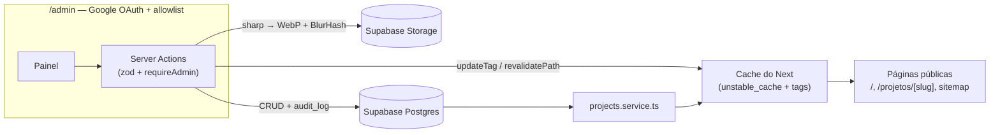

# W.VIANA — site institucional + painel de conteúdo

Site do escritório de arquitetura e interiores W.VIANA (Fortaleza/CE), com um painel administrativo em `/admin` que o próprio escritório usa para manter o portfólio.

Em produção: **[wvianaarquitetura.com.br](https://wvianaarquitetura.com.br/)**

## Contexto

Projeto real, desenvolvido sob encomenda para o arquiteto Wellington Viana. O site cumpre dois papéis: apresentar o portfólio com o acabamento que a marca pede (tipografia própria, fotos em alta resolução, movimento dirigido por scroll) e converter visita em contato — o formulário abre a conversa no WhatsApp e alimenta e-mail e planilha em paralelo.

O painel resolve o problema de manutenção: o escritório cria, edita, reordena e publica projetos sozinho, sem dev no meio e sem redeploy.

## Interface e movimento

A base visual vem do manual da marca: Aeonik no corpo, Agrandir Narrow nos títulos (fontes locais via `next/font/local`), três cores (`#000000`, `#BAAEA4`, `#F2F2F2`) e rótulos em caixa alta com tracking largo. Sobre ela, um sistema de movimento em GSAP que tenta traduzir gestos de arquitetura em vez de usar fade genérico:

- **Intro e transições de rota.** Na primeira visita da sessão, um loader desenha uma linha de horizonte e apresenta a marca — encurtado de ~3,2s para ~2s quando medimos que o overlay opaco atrasava o LCP. Entre rotas, uma cortina taupe varre a tela (`scaleX` com `transformOrigin` trocando de lado no meio do gesto). A orquestração é por evento, não por timeout: a cortina dispara `PAGE_TRANSITION_COMPLETE_EVENT` e a hero só anima quando ele chega, com fallback de 250ms para nunca ficar presa esperando.
- **Hero.** O logo SVG é lido do disco no servidor e embutido no HTML (sem fetch no cliente) e se desenha traço a traço — `strokeDasharray`/`strokeDashoffset` por `<path>`, com stagger — antes do preenchimento entrar. O estado inicial é aplicado em `useLayoutEffect`, antes do paint, então o primeiro frame já é o contorno se desenhando, sem flash do logo cheio. Detalhe de React que deu trabalho: a animação pinta os paths imperativamente, e qualquer re-render do pai re-injetava o markup vazio e apagava o desenho — o subtree do SVG é memoizado com comparador sempre-igual para o React montá-lo uma vez e nunca reconciliá-lo.
- **Vocabulário de reveals.** `use-architectural-reveal` define cinco padrões de entrada acionados por classe CSS — `.reveal-illuminate` (luz subindo de opacity 0.06), `.reveal-rise`, `.reveal-curtain` (wipe de `clip-path`), `.reveal-draw` (linha que se estende) e `.reveal-stagger`. Seções novas compõem com classes em vez de reescrever timelines.
- **Scroll.** Lenis (lerp 0.08) dirigido pelo ticker do GSAP — um único loop de rAF alimenta o smooth scroll e o ScrollTrigger. A restauração de posição é manual (sessionStorage por rota, cobrindo reload e voltar/avançar), porque Lenis e App Router disputam a posição. Na vitrine de projetos da home há um snap direcional próprio: rolando pra baixo, o card que cruzou 20% da viewport encosta logo abaixo do header, e um card "espiando" na borda é devolvido pra fora da dobra; rolando pra cima, a lógica inverte.
- **Reduced motion.** Toda animação checa `prefers-reduced-motion` — e em vez de só pular, seta o estado final (conteúdo visível, linhas desenhadas). O painel admin dispensa intro e cortina: é área de trabalho, não vitrine.

## Stack

- **Next.js 16 (App Router) + React 19 + TypeScript** — um app só serve o site público (Server Components, páginas de projeto pré-renderizadas) e o painel (Server Actions).
- **GSAP + ScrollTrigger e Lenis** — animações dirigidas por scroll; registro de plugin centralizado em `src/lib/gsap.ts`.
- **Supabase** — Postgres (conteúdo), Auth (login Google do painel) e Storage (fotos) num serviço só. RLS garante que o público lê apenas o que está publicado.
- **sharp + blurhash** — pipeline de imagem no servidor: recompressão WebP e placeholders (detalhes nas decisões abaixo).
- **Tailwind CSS** — utilitários no dia a dia; tokens da marca em CSS custom properties no `globals.css`.
- **Resend** — e-mail transacional de leads.
- **dnd-kit, Radix UI, zod, zustand** — reordenação drag-and-drop no painel, primitivos de UI, validação das Server Actions, estado de UI.

## Arquitetura

Duas superfícies no mesmo app: o site público e o painel `/admin`.



- `src/services/projects.service.ts` é o único ponto de leitura de conteúdo. Ele busca projetos, galerias e destaques do Supabase e entrega tudo já cacheado — home, listagem, página de projeto e sitemap consomem a mesma função.
- `src/proxy.ts` (o middleware do Next 16) renova a sessão do Supabase a cada request e barra `/admin` sem login. Cada Server Action revalida a permissão de novo (`requireAdmin` consulta a tabela `admin_users`), então a proteção não depende só do middleware — e o RLS do banco é a última camada.
- O schema completo está em `supabase/migrations/` (projetos, galeria, destaques da home, usuários admin e trilha de auditoria).
- Um mapa mais detalhado de onde cada coisa vive está em [docs/ARCHITECTURE.md](docs/ARCHITECTURE.md).

### O painel

- Login com Google via Supabase Auth + allowlist na tabela `admin_users`.
- Fluxo editorial draft → published: salvar nunca muda o site público; **Publicar** é uma ação explícita, e é ela que invalida o cache.
- Editor de galeria com upload múltiplo, reordenação por drag-and-drop, alt text por imagem e lightbox de conferência com navegação por teclado.
- Destaques da home: o cliente escolhe e ordena os 3 projetos da vitrine.
- Diff das alterações antes de salvar e guarda de alterações não salvas — cobre fechar aba, F5, voltar do navegador e links internos do painel.
- `/admin/logs`: trilha de auditoria navegável.

## Decisões de engenharia

### A abertura anima sem pagar em LCP

A primeira carga empilha três camadas de movimento (intro, cortina, desenho do logo) e mesmo assim protege a métrica: na primeira carga o conteúdo **não** começa invisível — a cortina cobre por cima enquanto o paint acontece por baixo e registra o LCP (uma flag de módulo distingue primeira carga de navegação interna, já que o `template.tsx` remonta o componente a cada rota). O logo da hero vai inline no HTML em vez de fetch, e a intro foi encurtada quando ficou claro que atrasava a métrica. O custo é orquestração mais delicada — eventos entre cortina e hero, fallbacks de timer — em troca de estética que não aparece no relatório de performance como regressão.

### Compressão de imagem em duas etapas, com uma única perda

Foto de arquitetura chega da câmera com 10–20 MB. Comprimir no navegador e de novo no servidor gera perda dupla (canvas q0.8 seguido de sharp q0.8 arruína degradês de céu e sombra — justamente o que mais aparece nessas fotos). A divisão adotada: o canvas do navegador só **redimensiona** (teto de 3200px, q0.95, quase sem perda), para a Server Action não receber o arquivo cru; o sharp no servidor é a única etapa com perda real (WebP q85) antes do upload para o Storage com cache de 1 ano. O custo é aceitar payloads maiores na action (`bodySizeLimit: 20mb` em `next.config.ts`).

### Placeholder BlurHash decodificado no servidor

Cada upload gera um BlurHash (~24 caracteres) gravado junto da imagem, em paralelo com o envio ao Storage. Na renderização, o hash vira um PNG 32×32 em data URL **no servidor**, dentro do mesmo `unstable_cache` — o placeholder já vem no HTML inicial e aparece antes de qualquer JavaScript hidratar. Guardar o hash (e não o data URL) mantém o banco leve; decodificar no server (e não no cliente) é o que faz o `placeholder="blur"` do `next/image` valer a pena. `pnpm backfill:blurhash` cobre imagens anteriores ao pipeline.

### Publicar invalida cache, não gera redeploy

O conteúdo vive no Postgres, mas nenhuma request pública espera o banco: a leitura passa por `unstable_cache` com tags (`projects`, `home_featured`) e revalidação de fallback em 1h. A ação Publicar chama `updateTag`/`revalidatePath` e o conteúdo entra no ar em segundos. O site mantém a latência de páginas servidas de cache e o cliente não depende de rebuild. Rascunho não vaza nem com cache frio — a query já filtra `published_status = 'published'`.

### Trilha de auditoria append-only

Quem opera o painel não é dev, então erro precisa ser rastreável. Toda escrita registra em `audit_log` quem fez, quando e o quê: edições guardam o diff campo a campo, exclusões guardam o snapshot completo do projeto (dá para reconstruí-lo se necessário). A tabela não tem policy de escrita via RLS — só a service role das Server Actions insere, então nenhum usuário logado consegue forjar ou apagar registros.

## Leads, analytics e SEO

**Leads.** O formulário abre o WhatsApp com a mensagem preenchida; a captura roda em paralelo com `fetch` fire-and-forget e `keepalive: true` (sem isso, o iOS Safari cancela a request quando o `window.open` rouba o foco). No servidor, `/api/contact` sanitiza e valida, descarta bots via honeypot (respondendo 200 para não dar pista), aplica rate limit de 5 req/min/IP e despacha para dois destinos com `Promise.allSettled` — e-mail (Resend) e planilha (Apps Script). Um destino fora do ar não perde o lead; a rota só falha se os dois falharem. O rate limit é janela deslizante em memória, suficiente para a escala do site (o código anota a troca por Upstash/KV se um dia precisar).

**Analytics e consentimento.** GTM só carrega se `NEXT_PUBLIC_GTM_ID` existir. Consent Mode v2 com default *denied*, aplicado por script inline antes da hidratação (o consentimento salvo em localStorage é reaplicado ali). `page_view` é disparado manualmente a cada navegação, porque o App Router não emite. O banner de cookies espera a hero sair da viewport antes de aparecer — nada de cobrir a abertura do site. Panorama em `docs/ANALYTICS_TRACKING.md`.

**SEO.** Metadata por rota via helper `pageMeta`, imagens OG geradas por `opengraph-image.tsx`, JSON-LD de organização e sitemap montado a partir do banco — projeto publicado no painel entra no sitemap com `lastModified` real, sem passo manual.

## Rodando localmente

```bash
pnpm install
cp .env.example .env.local   # preencha conforme os comentários do arquivo
pnpm dev
```

O `.env.example` documenta cada variável. Em resumo:

| Grupo | Variáveis | Sem elas |
|---|---|---|
| Supabase | `NEXT_PUBLIC_SUPABASE_URL`, `NEXT_PUBLIC_SUPABASE_ANON_KEY`, `SUPABASE_SERVICE_ROLE_KEY` | o site sobe, mas sem projetos; `/admin` não loga |
| Leads | `RESEND_API_KEY`, `LEAD_FROM_EMAIL`, `LEAD_NOTIFICATION_EMAIL`, `LEADS_SHEET_WEBHOOK_URL` | o formulário funciona, mas a captura só loga erro no server |
| Analytics | `NEXT_PUBLIC_GTM_ID` | GTM não carrega e os eventos ficam inertes no dataLayer (bom para dev) |

Para o painel completo: crie um projeto no Supabase, aplique as migrations de `supabase/migrations/` na ordem, habilite o provider Google no Auth e insira seu usuário na tabela `admin_users` após o primeiro login.

Outros scripts:

```bash
pnpm build               # build de produção
pnpm lint                # ESLint
pnpm format              # Prettier
pnpm backfill:blurhash   # gera BlurHash para imagens antigas
```

Deploy em produção: Vercel, via integração nativa com o repositório. Não há testes automatizados no projeto.

## Estrutura de pastas

```
src/
├── app/                  # rotas (App Router)
│   ├── admin/            # painel: login, projetos, destaques, logs + _actions/
│   ├── api/contact/      # endpoint de leads
│   └── ...               # páginas públicas (/, projetos, processo, sobre, contato)
├── components/
│   ├── admin/            # form de projeto, editor de galeria, lightbox, diff
│   ├── sections/         # seções animadas da home
│   ├── project/          # blocos da página de projeto
│   ├── layout/, ui/      # chrome do site e primitivos de UI
│   └── providers/        # intro loader, page transition, smooth scroll
├── hooks/                # use-architectural-reveal e guardas do admin
├── lib/                  # gsap, supabase, blurhash, seo, analytics, consent,
│                         # rate-limit, image-compress
├── services/             # leitura de dados (projects, audit)
├── proxy.ts              # middleware: sessão Supabase + gate do /admin
└── store/, types/
supabase/migrations/      # schema: projects, galeria, destaques, admin, audit_log
scripts/                  # backfill de BlurHash
```

## Créditos

Desenvolvido por [Eduardo Genes](https://github.com/eduardogenes) para o escritório W.VIANA. Fotos, textos e identidade visual (tipografia e cores do manual da marca) pertencem ao escritório. O código está público como parte do meu portfólio, não como template para reuso.
